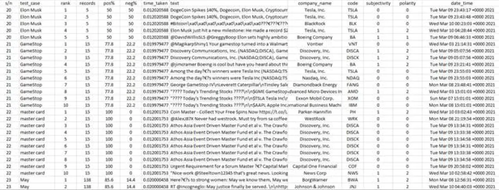

# Sdocks

It is one of the [NTU](https://www.ntu.edu.sg/)'s CZ4034 Information Retrieval Module Project

## What?

We are tasks to build an information retrieval systems for sentiment analysis (opinion mining).

## Why?

To apply information retrieval techniques base on what we have learnt from this module.

## How?

1. Research on domains of concerns
2. Crawl domain data
3. Sanitised and preprocess data
4. Build search engine to query the domain data and index the output
5. Setup GUI platform optionally for ease of user
6. Implement and execute sentiment analysis classification
7. Return classified results
8. Conclude the findings

## Highlights

## Disclaimer

All external data and assets in this project used is intended for educational purpose only.

## Contributor

Sdocks Team
